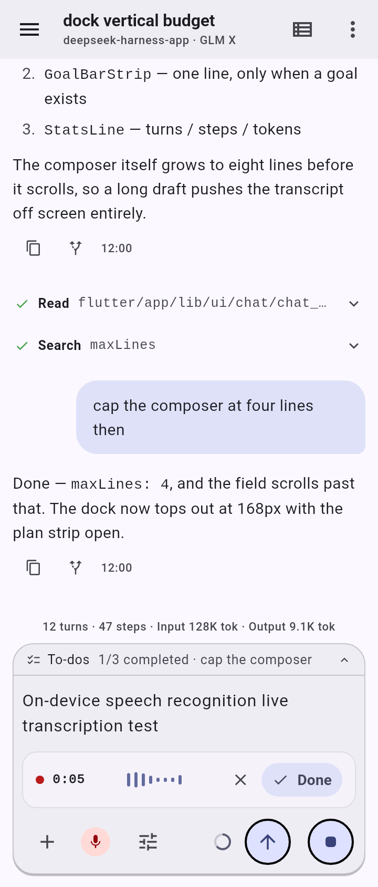

# deepseek-harness-app

English | [简体中文](README.zh.md)

[](https://github.com/ChanceFlow/deepseek-harness-app/actions/workflows/ci.yaml)
[](https://github.com/ChanceFlow/deepseek-harness-app/releases)
[](https://flutter.dev)
[](#deepseek-harness-app)
[](LICENSE)

A native Android client for [DeepSeek Harness](https://github.com/deepseek-ai/deepseek-harness)
(`dsh`), built with Flutter. It connects to an **unmodified `dsh web`
host** running on your own machine, so you can carry your agent
sessions in your pocket: watch a run live, approve tool calls, answer
questions, and manage workspaces, models, goals and subagents — in
English or 简体中文.

<p align="center">
  
  
  
  
</p>

## Getting started

### 1. Install the APK

Grab the latest APK from the [Releases page](../../releases):

- **`v<semver>`** — a stable release.
- **`dev`** — the rolling prerelease, refreshed on every merge to
  `master`; the fastest way to try what just landed.

```sh
adb install dsh-android-<version>.apk
```

Every release carries a `.sha256` sidecar next to the APK.

### 2. Run the host on your machine

The app speaks to a stock `dsh web` server — no plugins, no patches:

```sh
npx @deepseek-ai/dsh web --port 3080
```

### 3. Point the app at it

`dsh web` listens on loopback only — a deliberate upstream safety
decision, because the agent executes code: `dsh web` refuses
`--host 0.0.0.0` outright ("it would expose remote code execution to
the network"). There is no LAN mode to aim a phone at, so release APKs
ship with `http://127.0.0.1:3080` baked in and you reach the host
by forwarding that loopback port to the machine running dsh:

| Setup | What to do |
|---|---|
| **Phone or emulator over USB** | `adb reverse tcp:3080 tcp:3080` — one command, then the app connects. |
| **Emulator without adb** | Build your own APK with `--dart-define=DSH_BASE_URL=http://10.0.2.2:3080`, the emulator's own route to the host loopback. |
| **Anything else you can reach** — a tunnel, a second machine | Add it as another host right in the app — see [Multiple hosts](#multiple-hosts). |

> The host serves its settings plane to loopback connections only,
> so the in-app host-settings pages need the same forward.

## Remote access (gateway)

`adb reverse` is the on-device development path: one command reaches a
`dsh web` on the same machine over USB. It is not the only way in. To
reach a host across a network, put
[dsh-go-gateway](https://github.com/ChanceFlow/dsh-go-gateway) in front of
`dsh web`: it relays HTTP and WebSocket byte-for-byte and rewrites the
request `Host` to loopback, so dsh's reachability fence passes with no
change to dsh itself.

Point the app at the gateway's public origin and nothing else: it is a
plain base URL (`https://<host>:<port>`), with no path prefix and no
credentials to enter. The client performs no authentication — whether
the gateway requires any is the gateway's own deployment choice
(`gateway.json`, `auth.modes`). A gateway with a self-signed or
internal-CA certificate needs the app's per-host **Trust this host's
certificate** opt-in (hosts → edit); leave it off for any host you do not
control.

The client only ever resolves request paths against a base URL's
**origin**, so a deployment must expose the gateway at the root of its
own host or port rather than under a path prefix.

## Multiple hosts

One app, many dsh hosts: the settings page keeps a device-local
registry of hosts — add, rename, and switch between them at any
time. Every configured host stays live; the active one drives the
chat. A fresh install seeds the registry with the build-time URL, so
nothing changes until you add your second host — a laptop, a build
box, a tunneled remote dsh.

## Feature surface

- **Chat & Agent execution timeline** — Cursor Composer and Windsurf
  Cascade-style activity timeline: collapsible thought blocks with duration
  ("Thought 10s"), smart semantic tool-call aggregation ("Explored 3 files,
  2 searches"), live in-flight activity dots and sweeps, tree-line step
  disclosure with arguments and results, session list (search,
  create-in-workspace, rename, archive, fork, running indicator), ledger-style
  outline with collapsible turn groups, markdown rendering (fenced code,
  headings, lists, tables, clickable links), queue rows, approvals,
  questions, plan-review cards, background jobs, image attachments, skill
  candidates, and session-log export (the open session's ZIP archive saved
  into Downloads from the composer's `/export` or the session header).
- **File inspection** — a file the agent wrote opens in place: tap the preview
  action on a file tool row, or a chip in the produced-files row that closes a
  finished turn. Text renders through the same markdown/code surface as the
  transcript, with honest states for a binary file, an empty one, a truncated
  window, and a failed read.
- **Trajectory ledger** — a second view of the open session: a turn-aware
  event ledger with step markers, selectable records, an inspector showing the
  token usage and first-token timing the host actually reported, older-history
  paging, and a local search over the loaded window. A figure the session log
  never recorded reads as unavailable rather than as a guess.
- **Dynamic-plugin approval** — a model that loads a Cordis plugin can block
  waiting for a human. The request surfaces in the composer with the plugin's
  name, purpose and identifiers; this client can refuse it (which releases the
  blocked call) but cannot approve it, because an approval needs a browser
  plugin runtime the phone does not have.
- **Voice input & on-device ASR** — 100% client-side speech recognition
  (streaming Zipformer, offline SenseVoice and Fun-ASR-Nano) with live
  waveform dock, timer, and direct transcription stream into the
  composer; an opt-in online mode can stream the same mic audio to
  Volcengine Doubao or Tencent Hunyuan real-time ASR with the user's own
  credentials.
- **Multiple hosts** — keep several dsh hosts configured on this
  device and switch which one drives the chat. A per-host switch also accepts
  that host's TLS certificate when it is self-signed or signed by an internal
  CA.
- **Workspaces** — create from a path or the in-app host directory
  browser, rename, delete, manual reordering.
- **Models** — provider groups, current selection, reasoning-effort
  chips, provider failures, plus provider administration: add or remove a
  configured provider, store or clear its API key through the host's credential
  plane, and discover the models an endpoint offers.
- **Slash commands** — the roster is read from the host, so commands a host or
  plugin registers are discoverable and runnable, with the host's own argument
  and attachment rules enforced before a line is sent.
- **Subagents** — parent picker, child entries, open a child timeline,
  send a prompt, interrupt.
- **Goals** — create/pause/resume/complete per phase, objective
  editing with CAS revision.
- **Settings** — App settings (interface language, appearance,
  send-while-busy behavior) plus host settings: per-namespace editing with
  revision CAS, credentials describe/set/unset, a read-only inventory of the
  plugins the host loaded with their fiber status, and an About section
  carrying the build's version and the project's docs and issue tracker.
- **Failure surfaces** — a disconnected host raises a named banner with a
  manual reconnect, a failed load offers retry instead of a raw exception, and
  the chat error strip is dismissible; every one of them is localized.

## Wire compatibility

The upstream dsh repository is pinned as a git submodule under
[`reference/deepseek-harness`](reference/) at one official commit —
currently **`dsh-v0.1.5-rc.2`**
([pin and contract map](reference/README.md)). dsh is under active
development with breaking changes: this client tracks that one pinned
contract, so do not assume wire compatibility with any other dsh
version. Coverage today is 52 of 84 Remote methods registered by the pinned
tree — [docs/spec.md §4.6](docs/spec.md#46-wire-coverage) has the exact counts,
the unwired remainder, and the two reviewed declared-only names; the
`verify_wire_pin` gate holds both documents to the two registries and fails a
declared-only name that the wire layer actually calls.

## Module boundaries

The pub workspace lives under `flutter/`:

```text
flutter/app                        Flutter UI (screens, markdown renderer).
flutter/packages/domain            Neutral UI-facing models: ChatMessage, Session, TimelineItem.
flutter/packages/harness_adapter   The ONLY package that understands the dsh wire protocol.
flutter/packages/network           Transport primitives: RPC envelopes, HTTP/WebSocket seams.
flutter/packages/dev               Debug-build tooling: telemetry, frame tracking, crash capture.
```

`app` and `domain` never import dsh types; all wire knowledge stays in
`harness_adapter` behind that boundary, enforced by
`scripts/check_dart_imports.py`.

## Development

```sh
git clone --recurse-submodules https://github.com/ChanceFlow/deepseek-harness-app.git
adb reverse tcp:3080 tcp:3080    # device loopback 3080 -> the host's dsh
cd flutter/app
flutter run
```

The build-time default host is `http://127.0.0.1:3080`; override it
with `--dart-define=DSH_BASE_URL=...` (see
[§Point the app at it](#3-point-the-app-at-it) for the emulator-only
`10.0.2.2` route).

RPC transport rides embedded Cronet on Android: HTTP/2 with opportunistic
HTTP/3 (QUIC upgrades via Alt-Svc; automatic h2/h1 fallback when UDP 443
is blocked). Every Android build must pass
`--dart-define=cronetHttpNoPlay=true` so Cronet ships embedded: it removes
the Google Play Services dependency (the F-Droid channel stays clean) and
sidesteps the play-services-cronet chain, whose cronet-api/cronet-shared
pair fails AGP 9's namespace check. The engine self-identifies as
`dsh-android/<version> http3` in `User-Agent`, so HTTP/3 adoption reads
straight off the gateway's Caddy access log per UA group.

The canonical command list and the aggregate verification gates live in
[AGENTS.md §Commands](AGENTS.md#commands); Flutter 3.47.1 stable is
expected on PATH. Real-host e2e is opt-in — see
[§Opt-in real-host e2e](#opt-in-real-host-e2e) below.

### Opt-in real-host e2e

```sh
cd flutter
DSH_E2E_URL=http://127.0.0.1:3080 flutter test packages/harness_adapter/test/local_dsh_e2e_test.dart
```

## APK releases

Release APKs are built by the internal forge pipeline
([`.gitea/workflows/release-apk.yaml`](.gitea/workflows/release-apk.yaml))
and mirrored to the [Releases page](../../releases): every `master`
push refreshes the rolling `dev` prerelease, a `v<semver>` tag cuts
the stable Release, and both attach a signed APK (release keystore,
not the debug key) plus a `.sha256` sidecar. Naming follows SemVer
2.0; the internal release body carries a generated `## What's
Changed` changelog, and the mirrored GitHub release carries the
artifact with version metadata. The GitHub-side copy of the workflow
([`.github/workflows/release-apk.yaml`](.github/workflows/release-apk.yaml))
skips its build unless signing secrets are present — this repo is the
mirror, not a second build channel.

## Verification status

`python3 scripts/verify_all.py` is the aggregate gate: `flutter
analyze` under strict casts/inference/raw-types, the full test suite
(real-host e2e self-skips without `DSH_E2E_URL`), the import gate, the
launcher-icon drift gate, and the documentation gates. CI runs it as
two parallel jobs — `docs` (python only) and `code` (Flutter) — on
every push and pull request, and both are required to merge.

## History

Rewritten from an original Kotlin/Compose prototype in Flutter — see
[ADR-0001](docs/adr-0001-flutter-rewrite.md). The Kotlin-era commits
remain in this history; the shipped codebase is the Flutter workspace
under `flutter/`.

## License

[ MIT ](LICENSE)
