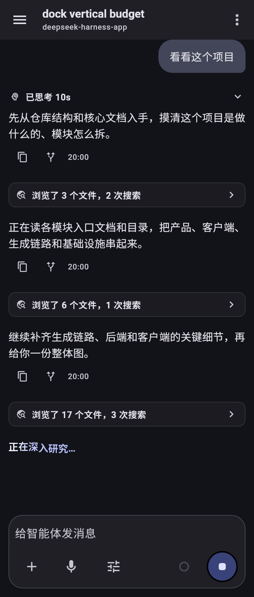
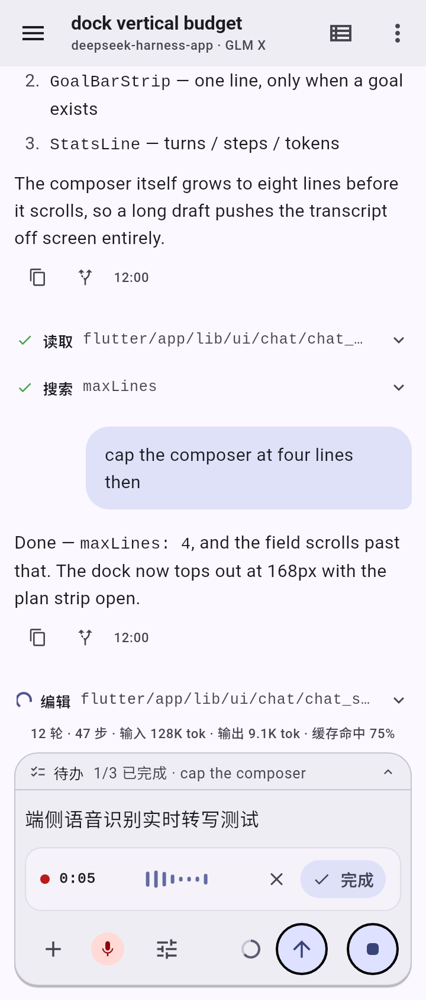

# deepseek-harness-app

[English](README.md) | 简体中文

[](https://github.com/ChanceFlow/deepseek-harness-app/actions/workflows/ci.yaml)
[](https://github.com/ChanceFlow/deepseek-harness-app/releases)
[](https://flutter.dev)
[](#deepseek-harness-app)
[](LICENSE)

基于 Flutter 开发的 [DeepSeek Harness](https://github.com/deepseek-ai/deepseek-harness)
（`dsh`）原生 Android 客户端。它连接运行在你电脑上的**未经修改的 `dsh web`
主机**，让你把 agent 会话装进口袋：实时观看任务运行、审批工具调用、回答问题、
管理工作区、模型、目标和子代理——支持英文和简体中文。

<p align="center">
  
  
  
  
</p>

## 快速开始

### 1. 安装 APK

从 [发布页](../../releases) 获取最新 APK：

- **`v<semver>`** — 稳定版。
- **`dev`** — 滚动预发布版，每次合入 `master` 都会刷新，是尝鲜最新功能最快的途径。

```sh
adb install dsh-android-<version>-arm64-v8a.apk
```

每个发布按 ABI 各出一个包——native 库就是全部体积，而一台手机只会用其中一个：

| APK | 装在哪 |
|---|---|
| `-arm64-v8a` | 2017 年之后的所有手机（拿这个） |
| `-armeabi-v7a` | 更早的 32 位手机 |
| `-x86_64` | 模拟器与 Chromebook |

每个 APK 都有自己的 `.sha256` 校验文件。每个发布还按 ABI 附带可下载的 ASR
运行时（`asr-runtime-<sherpaVersion>-<abi>-libonnxruntime.so` 与
`…-libsherpa-onnx-c-api.so`）：启用离线语音输入时，应用会抓取与自身 ABI 匹配的
那一对，并校验 `packages/asr/lib/src/runtime/asr_runtime_manifest.dart` 里的
尺寸与哈希。

### 2. 在电脑上启动主机

应用连接的是原生 `dsh web` 服务——无需插件、无需补丁：

```sh
npx @deepseek-ai/dsh web --port 3080
```

### 3. 连接主机

`dsh web` 只监听 loopback——这是上游出于安全的刻意决定，因为 agent 可以执行代码：
`dsh web` 会直接拒绝 `--host 0.0.0.0`（"会把远程代码执行暴露到网络上"）。dsh 没有
面向局域网的模式，所以发布 APK 内置 `http://127.0.0.1:3080`，你需要把这条 loopback
端口转发到运行 dsh 的电脑上：

| 场景 | 做法 |
|---|---|
| **USB 连接手机或模拟器** | `adb reverse tcp:3080 tcp:3080` —— 一条命令，应用即可连接。 |
| **不用 adb 的模拟器** | 用 `--dart-define=DSH_BASE_URL=http://10.0.2.2:3080` 自建 APK，这是模拟器访问宿主机 loopback 的专用路由。 |
| **其他任何可达端点** —— 隧道、第二台机器 | 直接在应用里把它加为另一台主机——见 [多主机](#多主机)。 |

> 主机只对 loopback 连接开放设置面，因此应用内的主机设置页也需要同样的端口转发。

## 多主机

一个应用，多个 dsh 主机：设置页维护一份设备本地的主机注册表——随时添加、重命名、
切换。每个已配置的主机都保持在线，激活的那个驱动聊天。全新安装时注册表以构建期
URL 为种子，所以在你添加第二台主机（笔记本、构建机、隧道连接的远程 dsh）之前，
一切如常。

## 功能一览

- **聊天与 Agent 执行时间轴** — 对齐 Cursor Composer 与 Windsurf Cascade
  风格的活动时间轴：带耗时的大模型思考块折叠（“已思考 10秒”）、语义化工具调用聚合
  （“浏览了 3 个文件，2 次搜索”）、实时执行脉冲点与扫光动效、树形步骤展开及入参与
  结果下钻、会话列表（搜索、在工作区内创建、重命名、归档、分叉、运行中指示）、
  扁平时间线与账本式大纲（可折叠回合分组、压缩标记）、Markdown 渲染（围栏代码、
  标题、列表、表格、可点击链接）、队列行、审批、提问、计划审阅卡片、后台任务、
  图片附件、技能候选、会话日志导出（从输入框的 `/export` 或会话标题栏
  把当前会话的 ZIP 归档保存到下载目录）。
- **文件查看** — agent 写出的文件可原地打开：点文件工具行上的预览动作，或点
  回合结束时产出文件行里的文件芯片。文本走与对话区相同的 Markdown/代码渲染，
  并对二进制文件、空文件、被截断的窗口与读取失败分别给出诚实的状态。
- **Trajectory 账本** — 当前会话的第二个视图：按回合组织的带步骤标记的事件账本、
  可选中记录、显示宿主**真实上报过**的 token 用量与首 token 时机的检查器、
  更早历史分页，以及针对已加载窗口的本地搜索。会话日志里没有记录的数值
  显示为“不可用”，而不是猜测值。
- **动态插件审批** — 模型加载 Cordis 插件时可能在等人批准而阻塞。该请求会出现在
  输入框区域，带插件名称、用途与标识；本客户端可以**拒绝**（这会释放被阻塞的调用），
  但无法批准——批准需要一个手机上并不存在的浏览器插件运行时。
- **端侧语音输入与 ASR** — 100% 离线端侧语音识别（流式 Zipformer，
  离线 SenseVoice 与 Fun-ASR-Nano），集成实时声浪波形底栏、计时器与流式文字上屏；
  另有可选的在线模式，可使用用户自备密钥将同一路麦克风音频流式送至火山引擎豆包
  或腾讯混元实时语音识别。模型与 sherpa-onnx 引擎都在你启用时按需下载，都不打进
  APK（光引擎每个安装就占 26 MB），因此没开这个功能前安装包一直很小。
- **多主机** — 在本机配置多个 dsh 主机，随时切换由哪个驱动聊天。按主机还可选择
  接受该主机的 TLS 证书，用于自签名或内网 CA 签发的场景。
- **工作区** — 从路径或应用内主机目录浏览器创建、重命名、删除、手动排序。
- **模型** — 提供商分组、当前选择、推理档位、提供商故障，以及提供商管理：
  增删已配置的提供商、通过宿主凭据面保存或清除其 API 密钥、发现端点提供的模型。
- **斜杠命令** — 命令目录从宿主读取，因此宿主或插件注册的命令也能被发现并执行，
  且发送前会按宿主自己的参数与附件规则校验。
- **子代理** — 父级选择器、子级条目、打开子级时间线、发送提示、中断。
- **目标** — 按阶段创建/暂停/恢复/完成，带 CAS 修订的目标编辑。
- **设置** — 应用设置（界面语言、外观、发送行为）与主机设置：按命名空间编辑并带
  修订 CAS，凭据的 describe/set/unset，宿主已加载插件的只读清单（含其 fiber 状态），
  以及一个 About 区段，带本次构建的版本与项目的文档、问题反馈入口。
- **失败面** — 主机断开时给出具名横幅与手动重连，加载失败给出重试而不是裸异常，
  聊天错误条可关闭；以上全部已本地化。

## 协议兼容性

上游 dsh 仓库以 git submodule 形式钉在 [`reference/deepseek-harness`](reference/)
下的一个官方提交——当前是 **`dsh-v0.1.5-rc.2`**
（[钉版本与契约文件映射](reference/README.md)）。dsh 正在快速迭代且有破坏性变更：
本客户端只追踪这一个钉死的契约，请勿假设与其他 dsh 版本协议兼容。目前覆盖钉死源码树
注册的 84 个 Remote 方法中的 52 个——精确计数、未接线余量与两个经复核的
「仅声明」名称见 [docs/spec.md §4.6](docs/spec.md#46-wire-coverage)，两者的一致性由
`verify_wire_pin` 门禁守护；该门禁还会让一个「仅声明」却被线上层实际调用的名称失败。

## 模块边界

pub 工作区位于 `flutter/` 下：

```text
flutter/app                        Flutter UI（界面、Markdown 渲染器）。
flutter/packages/domain            面向 UI 的中性模型：ChatMessage、Session、TimelineItem。
flutter/packages/harness_adapter   唯一理解 dsh 线上协议的包。
flutter/packages/network           传输原语：RPC 信封、HTTP/WebSocket 接缝。
flutter/packages/dev               调试构建工具：遥测、帧跟踪、崩溃采集。
```

`app` 和 `domain` 永不导入 dsh 类型；所有线上协议知识都隔离在 `harness_adapter`
边界之后，由 `scripts/check_dart_imports.py` 强制。

## 开发

```sh
git clone --recurse-submodules https://github.com/ChanceFlow/deepseek-harness-app.git
adb reverse tcp:3080 tcp:3080    # 设备 loopback 3080 -> 宿主机的 dsh
cd flutter/app
flutter run
```

构建期默认主机是 `http://127.0.0.1:3080`；可用 `--dart-define=DSH_BASE_URL=...`
覆盖（仅模拟器可用的 `10.0.2.2` 路由见 [§连接主机](#3-连接主机)）。

完整命令清单与聚合验证门禁见 [AGENTS.md §Commands](AGENTS.md#commands)；
PATH 上需要 Flutter 3.47.1 stable。真实主机端到端测试是可选开启的——见下方
[§可选真实主机端到端](#可选真实主机端到端)。

### 可选真实主机端到端

```sh
cd flutter
DSH_E2E_URL=http://127.0.0.1:3080 flutter test packages/harness_adapter/test/local_dsh_e2e_test.dart
```

## APK 发布

发布 APK 由内部 forge 流水线
（[`.gitea/workflows/release-apk.yaml`](.gitea/workflows/release-apk.yaml)）构建，
并镜像到 [发布页](../../releases)：每次 `master` 推送都会刷新滚动 `dev`
预发布版，`v<semver>` 标签切出稳定版，两者都附带按 ABI 拆分的签名 APK
（发布密钥库，非调试密钥），每个 APK 各有自己的 `.sha256` 校验文件。命名
遵循 SemVer 2.0；内部发布正文带自动生成的 `## What's Changed` 变更日志，
镜像到 GitHub 的发布则携带产物与版本元数据。GitHub 侧的同名工作流
（[`.github/workflows/release-apk.yaml`](.github/workflows/release-apk.yaml)）
在没有签名 secrets 时会跳过构建——本仓库是镜像，不是第二个构建渠道。

## 验证状态

`python3 scripts/verify_all.py` 是聚合门禁：严格 casts/inference/raw-types 下的
`flutter analyze`、完整测试套件（未设 `DSH_E2E_URL` 时真实主机端到端自动跳过）、
导入门禁、启动图标漂移门禁，以及文档门禁。CI 以两个并行任务运行它——`docs`
（仅 Python）和 `code`（Flutter）——每次推送和 PR 都会执行，两者都是合并必需。

## 历史

由最初的 Kotlin/Compose 原型用 Flutter 重写——见
[ADR-0001](docs/adr-0001-flutter-rewrite.md)。Kotlin 时代的提交保留在历史中；
当前发布的是 `flutter/` 下的 Flutter 工作区。

## 许可证

[ MIT ](LICENSE)
